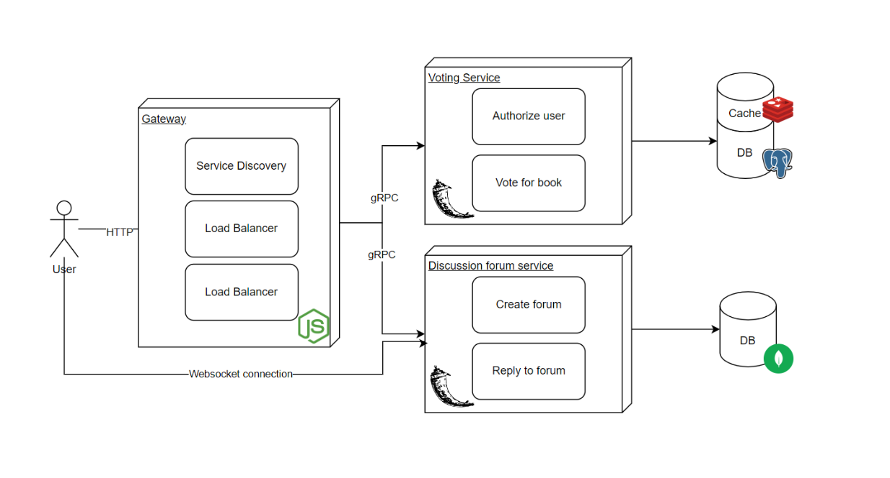

# Bookclub Platform

A platform that allows users to vote for a book that they will all read next month and discuss it in a specially created lobby. The MVP will consist of two microservices: one for a voting system to select the book of the month and another for real-time discussions. The voting service allows users to cast and view votes, while the discussion service creates a space for users to talk about the book.

### Application Suitability

The use of distributed systems in this case is relevant because:

- **Real-time Capability:**
  The discussion forum needs to operate in real-time and use websockets, while the voting service can rely on HTTP requests. Given the difference in communication methods, the use of microservices will ensure that the specific needs for each of them are met.

- **Scalability:**
  The voting system doesn't require a lot of resources, considering that it will be used by each user once a month. On the other hand, the chat forum will require more resources during peak usage. Creating them as different microservices will ensure that each component is scaled based on it's load.

- **Modular Growth:**
  The platform can be expanded by adding features like multiple book clubs, user profiles, or bookshelves. Adding them as separate services won't disturb the existing architecture of the system.

- **Improved Responsiveness:**
  The use of distributed systems will allow each service to respond quickly to user requests, considering that the services that are not called can run asynchronously.

**Similar real-world projects:**

- Goodreads - a popular platform for book lovers, where users can join groups or book clubs, vote on polls and participate in book discussions. Is likely that the service uses distributed systems to manage different functionalities. Each component can function independently which ensures the application's scalability with the growing number of users.

- Trello - a collaborative tool where users can create boards, lists, and cards to organize tasks. It has included a voting feature and real-time updates in shared workspace among other features. Trello operates on a microservices architecture, which ensures that all real-time functionalities are handles with precision.

### Service Boundaries

1. The `Voting Service` handles the process of choosing the book of the month by allowing the users to vote on available book options. It manages the vote submissions, tracks the results, and provides real-time updates regarding the voting procces.
2. The `Discussion Forum Service` enables users to participate in real-time conversations about the selected book by using websockets to facilitate live messaging.



### Technology Stack

**Gateway, Service Discovery, Load Balancer** in Node.js - Node.js is an event-driven framework that will be able to handle multiple requests at once, which is perfect for the gateway.

**Voting and Discussion Forum Services** in Flask - Flask is a lightweight and flexible framework that is perfect for building RESTful APIs.

**Voting Service Database** in PostgreSQL - The Voting Service requires strong data consistency and integrity, so a relational database as PostgreSQL will be a suitable choice for it.

**Discussion Forum Service Database** in MongoDB - The Discussion Forum will have high volumes of simultaneous requests so to handle the throughput efficiently we should use a non-relational database such as MongoSB.

**Cache** in Redis - Redis allows the Voting Service to store and retrieve the data about the voting process with extremely low latency.

**Inter-Service Communication** in gRPC - gRPC is much faster and more efficent communication than the traditional ones and it supports bi-directional streaming which enhances the real-time communication between services.

**User-Service Communication** as RESTful APIs - REST is a simple architecture that is ideal for microservices architecture, enabling the services to easily communicate with one another


### Data Management Design
#### Endpoints:
- ```GET /status``` - a common endpoint for both of the microservices to check if the services are running.

**Response:**
```
    {
        "service": "voting_service",
        "status": "running",
        "timestamp": "2024-09-06T15:00:00Z"
    }
```

**Voting Service Endpoints:**
- ```GET /books``` - retrive the list of books for voting.

**Response:**
```
    {
        "books": [
          {
            "id": 1,
            "title": "Title 1",
            "author": "Author 1",
            "description": "Brief description of the book",
            "votes": 120
          },
          {
            "id": 2,
            "title": "Title 2",
            "author": "Author 2",
            "description": "Brief description of the book",
            "votes": 85
          }
        ]
    }
```

- ```POST /vote``` - submit a vote for a specific book.

**Request:**
```
    {
        "book_id": 1,
        "user_id": 123
    }
```
**Response:**
```
    {
        "message": "Vote submitted successfully",
        "votes": 121
    }
```

- ``` GET /vote/status``` - get the number of votes for each book.

**Response:**
```
    {
        "status": [
        {
            "book_id": 1,
            "title": "Title 1",
            "votes": 121
        },
        {
            "book_id": 2,
            "title": "Title 2",
            "votes": 85
        }
        ]
    }
```

**Discussion Forum Service Endpoints:**
- ```GET /discussions``` - get a list of discussions for the book of the month.

**Response:**
```
    {
       "discussions": [
        {
            "thread_id": 1,
            "title": "Discussion Title 1",
            "author": "User123",
            "created_at": "2024-09-05T12:30:00Z",
            "replies": 10
        },
        {
            "thread_id": 2,
            "title": "Discussion Title 2",
            "author": "User456",
            "created_at": "2024-09-05T14:00:00Z",
            "replies": 5
        }
        ]
    }
```

- ```POST /discussion``` - create a new discussion thread.

**Request:**
```
    {
        "title": "New Discussion Title",
        "author": "User123",
        "content": "Content of the discussion"
    }
```

**Response:**
```
    {
        "message": "Discussion thread created successfully",
        "thread_id": 3
    }   
```

- ```POST /discussions/{thread_id}/reply``` - post a reply to a specific discussion thread.

**Request:**
```
    {
        "author": "User456",
        "content": "Reply content"
    }
```

**Response:**
```
    {
        "message": "Reply submitted successfully",
        "reply_id": 3
    }   
``` 

### Deployment and Scaling

To deploy the book club platform I will be using Docker, which will help me containerize each microservice and will ensure isolated execution. The deployment and scaling will be managed by Kubernetes. It will handle the load balancer, service discovery and the horizintal scaling, based on the load. The cache, created with Redis, will optimize performance by caching frequently accessed data.

